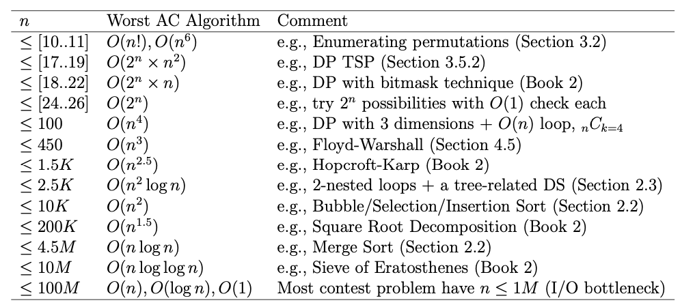

# NOTES FROM CP 4 BOOK

## Tips to be Competitive

1. Type Code Faster
2. Quickly Identify Problem Types
3. Do Algorithm Analysis
   
4. Master Programming Languages
5. Master the Art of Testing Code
6. Practice and More Practice


## Typical Input/Output Routines

### Multiple Test Cases

- Given two small positive integers (<=100) in one line,   output their sum in one line. We will illustrate three32 possible input/output formats:

1. The number of test cases is given in the first line of the input.
2. The multiple test cases are terminated by special values (usually zero(es)), regardless whether there are subsequent inputs afterwards.
3. The multiple test cases are terminated by the EOF (end-of-file) signal.


```c++
int tc ;
cin>>tc;  //number of test cases
while(tc--) {  // shortcut to repeat until zero
    int a, b;
    scanf("%d %d" ,&a, &b);
    printf(" %d\n" , a+b); // compute
}
```


2.
```c++
int a, b;  
// stop when both integers are  0
while(scanf("%d %d" ,&a, &b),(a || b)) { // it will stop when both inputs are 0 , it will ignore  1, 1 in example  
    printf(" %d\n" , a+b); // compute
}
```


```c++
int a, b;
// scanf returns the number of items read
while (scanf("%d %d", &a, &b) == 2)
// or you can check for EOF, i.e.,
// while (scanf("%d %d", &a, &b) != EOF) 
printf("%d\n", a+b);

```


 Case Numbers and Blank Lines

- Some problems with multiple test cases require the output of each test case to be numbered sequentially

```c++
int a, b, c = 0;
 while (scanf("%d %d", &a, &b) != EOF) {
 	// notice the two ‘\n’
 	printf("Case %d: %d\n\n",++c, a+b);
 }

``` 


- Variable Number of Inputs

For each test case (each input line), we are now given an integer k (k >= 1), followed by k integers. Our task is now to output the sum of these k integers.

```c++
int k;
while(scanf("%d",&k)!= EOF) {
	int ans = 0, v;
	while(k--) {
		scanf("%d" , &v);
		ans += v;
	}
	printf("%d\n",ans);
}
```


